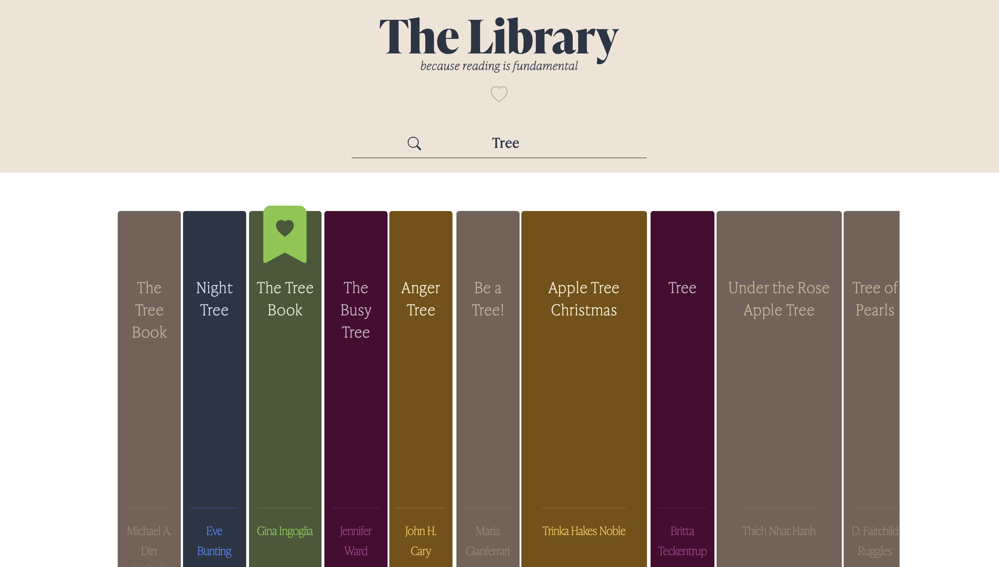
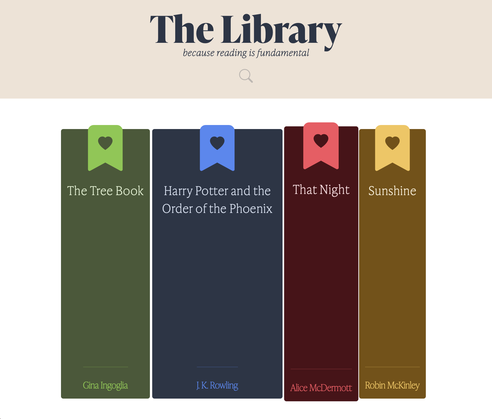

# The Library

<a href="https://opensource.org/licenses"></a>

## Table of Contents
* [Description](#description)
* [Installation Instructions](#installation-instructions)
* [Usage Information](#usage-information)
* [Contribution Guidelines](#contribution-guidelines)
* [License Information](#license-information)
* [Questions](#questions)

## Description
The Library is a web app interface which uses the Google Books API to look for titles and save them.

## Installation Instructions
run ```npm install``` after cloning, ensure to configure a local instance of Mongo DB or use ```.env``` and provide a remote db uri.

## Usage Information
The web app has a very straigt forward interface. From the home or start page, run a query by typing in the search field, click on a title and the information will be diplayed. From there you can add it to the favorites page by clicking on the book mark icon in the corner. Removing a saved book is as easy as doing the same thing!

### Search


### Favorites



## Contribution Guidelines
If you wish to contribute, email me or open an issue on GitHub

## License Information

<a href="https://opensource.org/licenses"></a>


		

## Questions
Email [hello@n8blake.com](mailto:hello@n8blake.com)
or create an issue on [Github](https://github.com/n8blake)  
